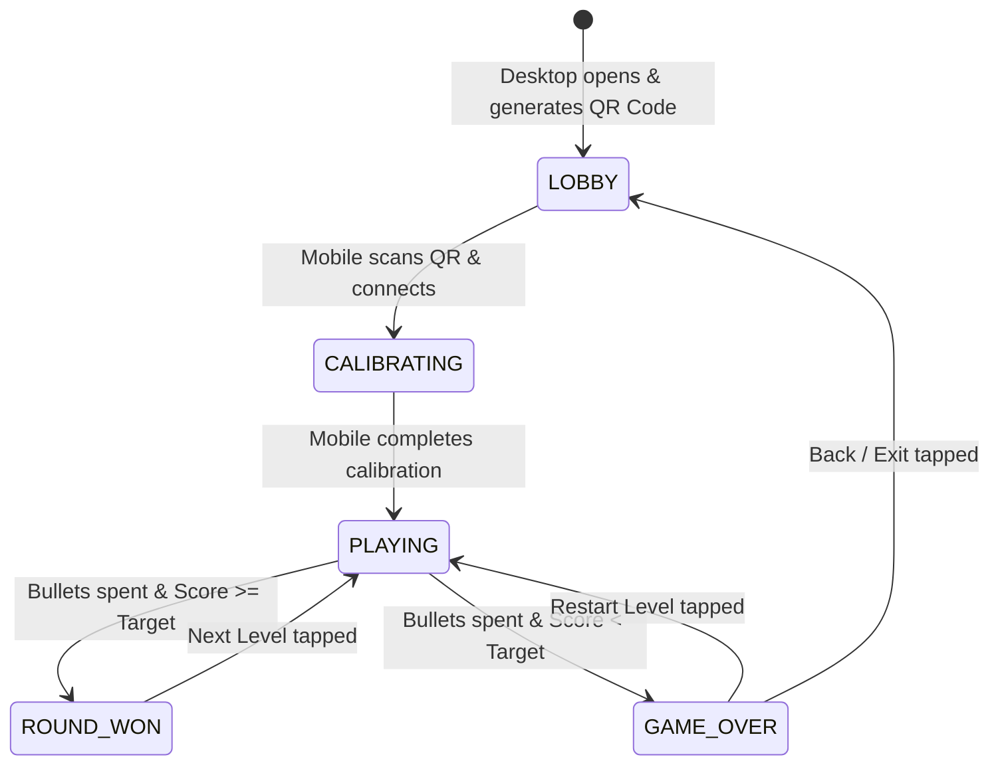

# Data Model: Motion-Controlled Multi-Screen Duck Shooter (Goose Hunter)

**Feature**: `001-motion-goose-hunter`  
**Date**: 2026-08-30  

## Entity Definitions

### 1. GameSession

Represents a multi-screen play room pairing a host desktop screen with one or more mobile motion controllers.

```typescript
interface GameSession {
  sessionId: string;            // Unique 6-character alphanumeric room code (e.g., "GH-7842")
  hostSocketId: string | null;  // Socket ID of desktop display
  controllerSocketId: string | null; // Socket ID of mobile phone
  status: SessionStatus;        // 'LOBBY' | 'CALIBRATING' | 'PLAYING' | 'ROUND_WON' | 'GAME_OVER'
  createdAt: number;
  lastActiveAt: number;
}

type SessionStatus = 'LOBBY' | 'CALIBRATING' | 'PLAYING' | 'ROUND_WON' | 'GAME_OVER';
```

---

### 2. MotionData & ControllerState

Represents the orientation and input state streamed from the smartphone.

```typescript
interface MotionCalibration {
  centerBeta: number;   // Pitch reference angle in degrees
  centerGamma: number;  // Roll/Yaw reference angle in degrees
  sensitivityX: number; // Deflection threshold for full screen horizontal span (default: 25 deg)
  sensitivityY: number; // Deflection threshold for full screen vertical span (default: 20 deg)
}

interface AimCoordinates {
  x: number;  // Normalized horizontal coordinate [-1.0 (left), 1.0 (right)]
  y: number;  // Normalized vertical coordinate [-1.0 (top), 1.0 (bottom)]
  timestamp: number;
}

interface TriggerEvent {
  sessionId: string;
  x: number;  // Normalized X at trigger pull
  y: number;  // Normalized Y at trigger pull
  timestamp: number;
}
```

---

### 3. GooseTarget

Represents a flying bird target in the canvas arena.

```typescript
type GooseType = 'BLACK' | 'BLUE' | 'RED';
type GooseState = 'SPAWNING' | 'FLYING' | 'HIT' | 'FALLING' | 'ESCAPED';

interface GooseTarget {
  id: string;
  type: GooseType;
  points: number;       // Black: 5, Blue: 10, Red: 15
  x: number;            // Arena X pixel position
  y: number;            // Arena Y pixel position
  vx: number;           // Horizontal velocity
  vy: number;           // Vertical velocity
  speed: number;        // Base speed magnitude
  width: number;        // Sprite bounding box width
  height: number;       // Sprite bounding box height
  state: GooseState;
  frameIndex: number;   // Current animation frame (wing flap / hit / falling)
  frameTimer: number;
  direction: 1 | -1;    // 1: facing right, -1: facing left
  flightDuration: number; // Seconds alive before escaping
}
```

---

### 4. LevelConfig & GameState

Defines round progression and current gameplay metrics.

```typescript
interface LevelConfig {
  level: number;         // 1 to 5
  targetScore: number;   // Level 1: 60, L2: 70, L3: 80, L4: 90, L5: 100
  totalBullets: number;  // 10 bullets per round
  simultaneousGeese: number; // L1: 1-2, L2: 2, L3: 3 (+1 extra), L4: 3, L5: 4 (+2 extra)
  baseSpeedMultiplier: number; // 1.0, 1.2, 1.4, 1.6, 1.8
  allowedTypes: GooseType[];
  themeBackground: string; // 'forest' | 'snow' | 'autumn' | 'swamp' | 'sunset'
}

interface GameRoundState {
  currentLevel: number;
  score: number;
  highScore: number;
  bulletsRemaining: number;
  missedShots: number;
  shotsFired: number;
  geeseHit: number;
  activeGeese: GooseTarget[];
  isSoloMouseMode: boolean;
  soundEnabled: boolean;
}
```

---

## State Transition Diagram


